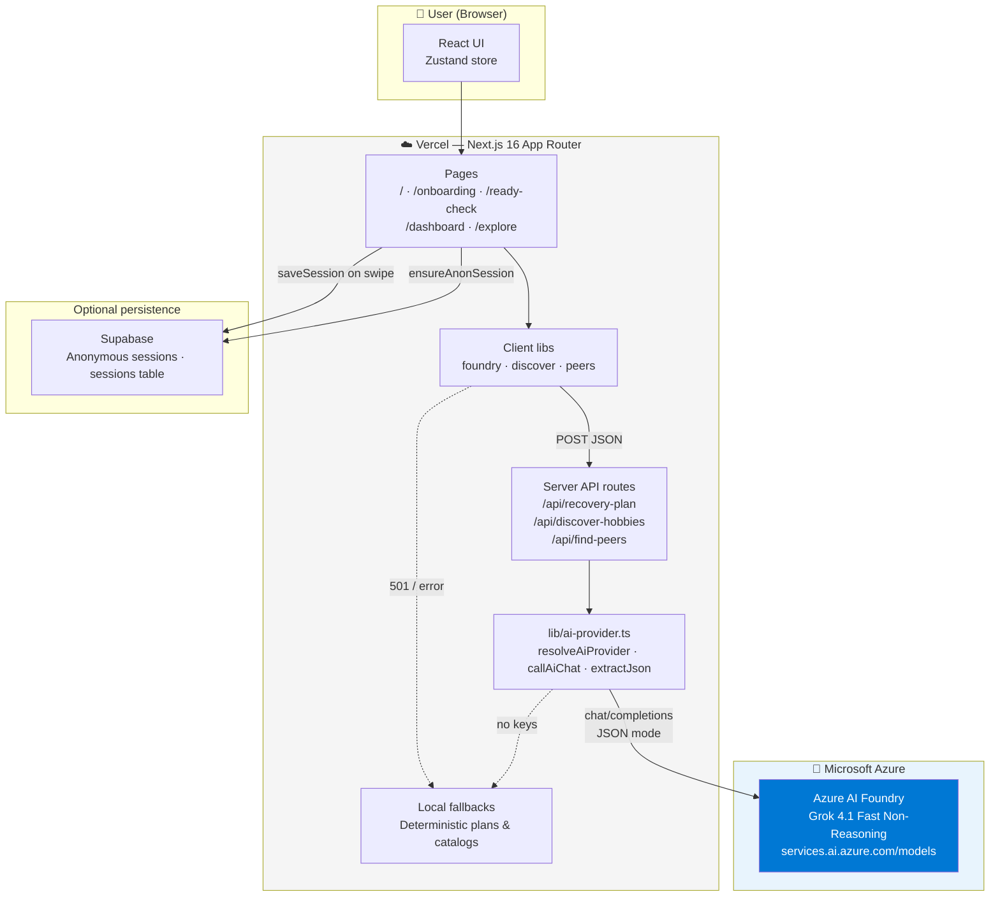
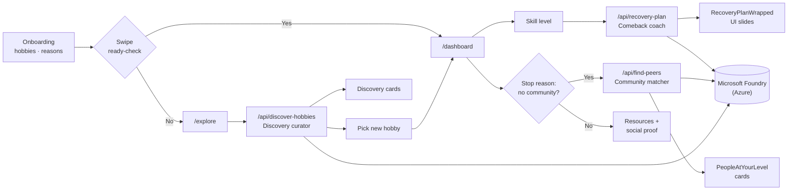

````markdown
# Rehobbie — Hobby Recovery App

## Purpose
Help users rediscover abandoned creative hobbies through a seamless, no-login onboarding flow — then hand them a personalised AI plan to actually start again. If they're not ready to resume, Foundry IQ suggests brand-new hobbies to discover instead.

---

## Features

### Onboarding (Phase 1)
- Hand-drawn aesthetic: lined-paper backgrounds + animated sketchy page border
- Illustrated hobby picker with cursive heading artwork
- Multi-select grid with auto-skip when only 1 hobby is picked
- Swipable yes/no card: *"wanna pick up where you left off?"*
- Zustand store carries state across all steps — no prop drilling, no login

### Dashboard — swipe yes (Phase 2)
- Skill-level selector (Novice → Expert + Just for fun)
- **Spotify Wrapped-style AI plan** — tap-through gradient slides, minimal words, big visuals
- Resource shelf (books / YouTube / communities) keyed by hobby
- **"People at your level"** — when loneliness was the stop reason, Foundry IQ finds communities at the user's exact skill level (Reddit, Discord, Meetup, etc.)
- "Others like you" social proof (shown when community matching isn't needed)

### Explore — swipe no (Phase 2)
- Foundry IQ curates **brand-new hobbies** the user has never tried — not old ones they abandoned
- Visual discovery cards: illustration + emoji + punchy hook + one-line appeal
- Tapping a card jumps straight to the dashboard in **discovery mode** with a first-time starter plan

### Integrations
- **Microsoft Foundry IQ (Grok)** — recovery plans, hobby discovery, peer matching (3 server routes)
- **Supabase** — anonymous sessions, journey persistence (optional)

---

## Tech Stack
- **Framework:** Next.js 16 (App Router, Turbopack), TypeScript
- **Styling:** Tailwind CSS v3 (`tailwind.config.ts` + `postcss.config.js`)
- **Animation:** Motion (`motion/react`)
- **State:** Zustand
- **Fonts:** Caveat (sketch) + Nunito, via `next/font/google`
- **AI:** Microsoft Foundry IQ via `lib/ai-provider.ts` (Grok 4.1 Fast on Azure)
- **Persistence:** Supabase anonymous sessions (`lib/supabase.ts`)

> Every integration is **optional and env-gated** — the app runs with zero config.
> AI features fall back to local generators when Foundry keys are missing.

---

## File Structure

```
app/
  page.tsx                      ← Home — horizontal hobby band, logo, get-started CTA
  layout.tsx                    ← Root layout + AnalyticsProvider
  global.css                    ← Tailwind layers, lined-paper, sketch-border styles
  onboarding/page.tsx           ← Step 1: hobby picker
  select-favorite/page.tsx      ← Step 2: pick favourite (auto-skipped if 1 hobby)
  why-stopped/page.tsx          ← Step 3: stop reasons
  ready-check/page.tsx          ← Step 4: swipe card → saves session to Supabase
  dashboard/page.tsx            ← Swipe yes / discovery → skill, Wrapped plan, peers, resources
  explore/page.tsx              ← Swipe no → Foundry hobby discovery cards

app/api/
  recovery-plan/route.ts        ← Foundry: personalised comeback / first-time plan
  discover-hobbies/route.ts     ← Foundry: brand-new hobby suggestions (swipe no)
  find-peers/route.ts           ← Foundry: communities at user's skill level

components/
  SketchBorder.tsx              ← Animated hand-drawn page border (SVG)
  PageFrame.tsx                 ← Scrollable Phase-2 page shell
  AnalyticsProvider.tsx         ← Supabase anon session bootstrap
  onboarding/                   ← HobbyCard, ReasonChip, SwipeCard, OnboardingShell
  dashboard/
    SkillSelector.tsx           ← Horizontal skill-level pills
    RecoveryPlanWrapped.tsx     ← Spotify Wrapped-style tap-through plan slides
    PeopleAtYourLevel.tsx       ← Foundry peer/community cards (no-community reason)
    ResourceShelf.tsx           ← Books / YouTube / community columns
    OthersLikeYou.tsx           ← Static social-proof strip

lib/
  hobbies.ts                    ← Hobbies, stop reasons, skill levels, discovery catalog
  resources.ts                  ← Resource cards keyed by hobby id
  ai-provider.ts                ← Shared Foundry / GitHub Models caller (server-side)
  foundry.ts                    ← Client → /api/recovery-plan + local fallback
  discover.ts                   ← Client → /api/discover-hobbies + local fallback
  peers.ts                      ← Client → /api/find-peers + local fallback
  supabase.ts                   ← Anonymous session + saveSession

store/onboarding.ts             ← Zustand store (selections, discovery flag, skill level)
types/index.ts                  ← All TypeScript types
```

---

## Quick Start

```bash
npm install
cp .env.local.example .env.local   # fill in keys to enable integrations
npm run dev
```

Open http://localhost:3000 — click "Get started" to enter the onboarding flow.

The app runs with **no `.env.local`** — AI falls back to local generators, Supabase no-ops.

### Styling requirements
- **Tailwind v3** is pinned with `postcss.config.js` (`tailwindcss` + `autoprefixer`).
- The `@/*` path alias is in `tsconfig.json`.

### Images
Illustrations live in `/public/images/`. Onboarding tiles use `*_select.png` files from
`lib/hobbies.ts`; the home page uses plain illustrations plus heading artwork
(`rehobbie_logo.png`, `used_to_like_heading.png`, `why_stopped.png`, `get_started_button.png`).

---

## Flow

```
/ (Home)
  ↓ Get started
/onboarding           — pick hobbies (1 or more)
  ↓ if 2+ selected
/select-favorite      — pick the one you loved most
  ↓ (skipped if only 1 hobby)
/why-stopped          — pick reasons for stopping
  ↓
/ready-check          — swipe right = yes, left = no
  ↓ yes                              ↓ no
/dashboard                           /explore
  skill level selector                 Foundry picks brand-new hobbies
  Wrapped AI plan (tap-through)        visual discovery cards
  peers at your level (if lonely)      tap → dashboard (discovery mode)
  resource shelf                       first-time Wrapped plan
  others like you
```

---

## Microsoft Foundry IQ — three AI surfaces

All calls run **server-side** (`lib/ai-provider.ts`) so keys never reach the browser.
Model: **Grok 4.1 Fast Non-Reasoning** (Direct from Azure) on the Foundry `services.ai.azure.com/models` endpoint.

| Route | Trigger | Input | Output |
|---|---|---|---|
| `/api/recovery-plan` | Dashboard + skill level picked | hobby, skill level, stop reasons, mode (`comeback` \| `discovery`) | Short JSON plan → Wrapped slides |
| `/api/discover-hobbies` | `/explore` page load (swipe no) | tried hobbies, rejected hobby, stop reasons, catalog | Headline + 3–4 visual discovery cards |
| `/api/find-peers` | Dashboard when "No one to do it with" selected | hobby, skill level | Headline + 3–4 community matches with URLs |

Each client lib (`foundry.ts`, `discover.ts`, `peers.ts`) falls back to a local deterministic generator if Foundry returns `501` or errors — so the UI always renders.

### Env vars (Foundry)
```
AZURE_FOUNDRY_ENDPOINT=https://<resource>.services.ai.azure.com
AZURE_FOUNDRY_API_KEY=<key>
AZURE_FOUNDRY_DEPLOYMENT=grok-4-1-fast-non-reasoning
AZURE_FOUNDRY_JSON_MODE=true
```

---

## Architecture

Rehobbie is a **Next.js 16** app on **Vercel**. All Microsoft Foundry calls run **server-side** so API keys never reach the browser. Three domain-specific AI surfaces share one provider (`lib/ai-provider.ts`) and fall back to local generators when Foundry is unavailable.

### Runtime diagram



### Swipe decision → AI path



### Microsoft stack mapping

| Technology | Role in Rehobbie |
|---|---|
| **Microsoft Foundry** | **Runtime AI** — three prompt-specialized surfaces (recovery plan, hobby discovery, peer matching) call **Grok 4.1 Fast** via the Foundry `services.ai.azure.com/models` endpoint. Shared caller: `lib/ai-provider.ts`. |
| **Azure services** | Foundry resource + deployment live on **Azure AI**; secrets stored in **Vercel** env vars (`AZURE_FOUNDRY_*`). App hosted at [rehobbie.vercel.app](https://rehobbie.vercel.app). |
| **Agent-style orchestration** | Each API route acts as a **domain agent** with its own system prompt and JSON schema — comeback coach, discovery curator, community matcher — orchestrated by the Next.js server layer (same pattern Agent Framework encourages, implemented as lightweight route handlers). |
| **GitHub Copilot** | **Build-time** — used to scaffold pages, plan Foundry integration phases, explain code, and generate unit tests (`copilot-instruct.md`, README build notes). |
| **Azure MCP** | **Build-time** — Azure MCP tooling supports Copilot/IDE access to Foundry endpoints, deployment names, and Azure resource context while wiring `ai-provider.ts` and env configuration. |

### Security & resilience

- **Keys server-only** — browser never sees `AZURE_FOUNDRY_API_KEY`.
- **Graceful degradation** — client libs fall back to deterministic local generators if Foundry returns `501` or malformed JSON.
- **Optional Supabase** — anonymous sign-in + `saveSession()` on swipe; no-op without keys.

---

## Environment & Integrations

Copy `.env.local.example` → `.env.local`. Each block is independent.

### Supabase — anonymous sessions
- `NEXT_PUBLIC_SUPABASE_URL`, `NEXT_PUBLIC_SUPABASE_ANON_KEY`
- `AnalyticsProvider` calls `ensureAnonSession()` on first load (no sign-up).
- `ready-check` fires `saveSession()` on swipe decision.
- Enable **Anonymous sign-ins** in Supabase → Authentication.
- Create the `sessions` table — SQL is in the comment at the top of `lib/supabase.ts`.

---

## Adding New Hobbies

Edit `lib/hobbies.ts` — the onboarding grid adapts automatically:

```ts
export const HOBBIES: Hobby[] = [
  { id: "photography", label: "Photography", image: "/images/camera_select.png" },
  // add here ↓
];
```

For discovery (explore page), also add to `NEW_HOBBIES` in the same file.
Optionally add resources in `lib/resources.ts` — generic fallback covers anything missing.

---


## Notes
- No user accounts — the flow respects "users abandon things easily."
- Zustand store is in-memory; a full browser reload resets onboarding state.
- The `SwipeCard` outer `<motion.div>` owns drag physics — keep it when swapping artwork.
- `.env.local` is gitignored; never commit real keys to `.env.local.example`.

---

## Testing

**Stack:** Vitest + jsdom, `@testing-library/react`, `@testing-library/jest-dom`, MSW. Shared fixtures live in `test/helpers/fixtures.ts`.

**Run locally:**

```bash
npm run test:run    # single run (CI-friendly)
npm test            # same as test:run
npm run test:watch  # watch mode
npm run typecheck   # tsc — app code only (test/ excluded)
npm run lint        # ESLint flat config
```

**Current suite:** 11 files, 39 tests — all passing (~2s). No live Foundry keys required; AI and network calls are mocked.

| Area | File | What it covers |
|---|---|---|
| **Store** | `test/store/onboarding.spec.ts` | `toggleHobby`, swipe yes/no state, `startDiscovery`, skill/reason toggles, `reset` |
| **API routes** | `test/api/recovery-plan.spec.ts` | 400/501/502 errors + valid AI plan response |
| | `test/api/discover-hobbies.spec.ts` | Empty catalog, AI off, catalog-id filtering, all-filtered 502 |
| | `test/api/find-peers.spec.ts` | Validation, 501, happy path, malformed AI payload |
| **Client libs** | `test/lib/foundry.spec.ts` | API success, comeback fallback, discovery fallback |
| | `test/lib/discover.spec.ts` | Invalid API payload fallback, valid API response |
| | `test/lib/peers.spec.ts` | API success, resource-based community fallback |
| **AI provider** | `test/lib/ai-provider.spec.ts` | GitHub Models resolution + upstream calls (MSW) |
| | `test/lib/ai-provider-foundry.spec.ts` | Foundry / Azure OpenAI URL resolution, provider priority |
| | `test/lib/extract-json.spec.ts` | Raw JSON, fenced blocks, embedded JSON parsing |
| **Pages** | `test/pages/ready-check.spec.tsx` | Render, swipe yes → `/dashboard` + `saveSession`, swipe no → `/explore` |

**Config:** `vitest.config.ts` (jsdom, `@/*` alias, globals) · `test/setup.ts` (MSW server lifecycle)

**Not covered yet:** dashboard/explore/onboarding page UI, individual components (`RecoveryPlanWrapped`, `HobbyKeycap`), E2E browser flows.

````

---

## How I built this

- Started by planning the flow manually, then using chatgpt to plan the tools to use and the file structure.
- Used copilot to install dependencies and create scaffolds of files.
- Used copilot to plan the phases and the implementation.
- Started with frontend — wanted a unique design and a more human feel for the UI.
- Used Figma to lay out pages and draw elements out.
- Used Gemini Nano Banana to clean up drawings and add color.
- Cut images out with Mac Preview and used them as components in the pages.
- Used Claude to bring Figma designs to life and iterate on design planning.
- Used copilot to plan next steps and explain code and progress so far.
- Used copilot to plan use of Foundry IQ and integration of Supabase.
- Used copilot for creating unit tests.

### FoundryIQ

- Uses `grok-4-1-fast-non-reasoning` for the AI surfaces.
- Creates a rediscovery plan based on experience level and factors that led to abandonment.
- If the factors include “didn’t find others to do it with”, it suggests communities to join based on experience level.
- Helps you discover new hobbies by creating a plan for the one you select.

## Live link
https://rehobbie.vercel.app/